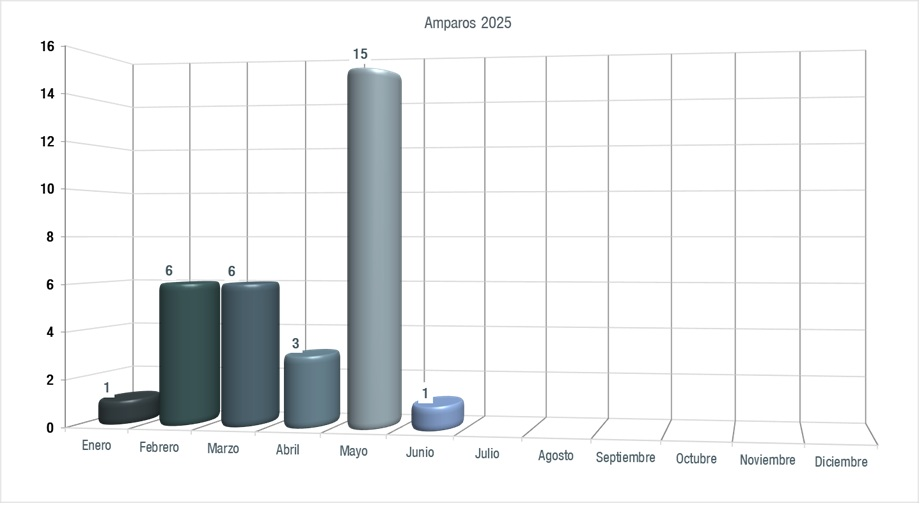

Title: Artículo 27, fracción XII. Estadísticas de amparos.
Slug: transparencia-articulo-27-ltaip-f12-estadisticas-de-amparos
Summary: Estadísticas de amparos concedidos en contra de las resoluciones emitidas por la autoridad.
Category: Transparencia
URL: transparencia/articulo-27-ltaip/f12-estadisticas-de-amparos/
Save_As: transparencia/articulo-27-ltaip/f12-estadisticas-de-amparos/index.html
Date: 2020-01-01 00:00:00
Modified: 2020-01-01 00:00:00

<nav aria-label="breadcrumb">
<ol class="breadcrumb">
<li class="breadcrumb-item"><a href="../../">Transparencia</a></li>
<li class="breadcrumb-item"><a href="../">Artículo 27 LTAIP</a></li>
<li class="breadcrumb-item active" aria-current="page">F12 Estadísticas de Amparos</li>
</ol>
</nav>

#### Responsable

Roberto Alejandro Ramírez Maldonado, Secretario General de Acuerdos del Tribunal de Conciliación y Arbitraje del Poder Judicial

#### Fecha de Validación

18 de julio de 2025

 

#### [HISTÓRICO Información 2017 - 2024](historico-informacion-2017-2024/)

## Descargar

- [Amparos TCA Enero-Diciembre 2025.pdf](https://storage.googleapis.com/pjecz-gob-mx/Transparencia/Artículo 27 LTAIP/F12 Estadísticas de Amparos/Amparos TCA Enero-Diciembre 2025.pdf)
- [Amparos TCA Enero-Diciembre 2025.xls](https://storage.googleapis.com/pjecz-gob-mx/Transparencia/Artículo 27 LTAIP/F12 Estadísticas de Amparos/Amparos TCA Enero-Diciembre 2025.xls)
